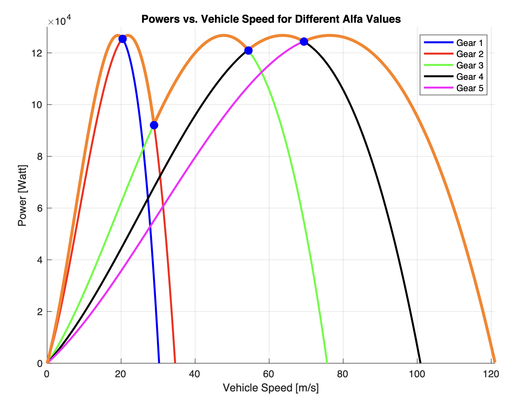
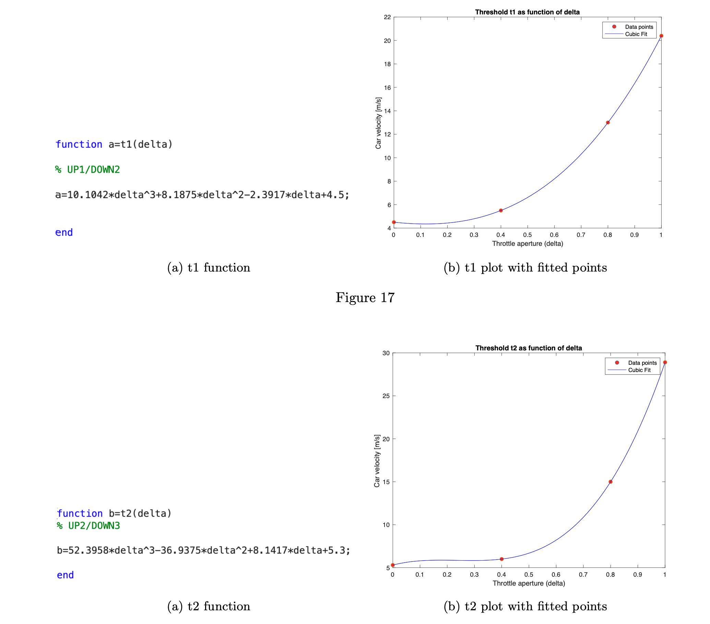
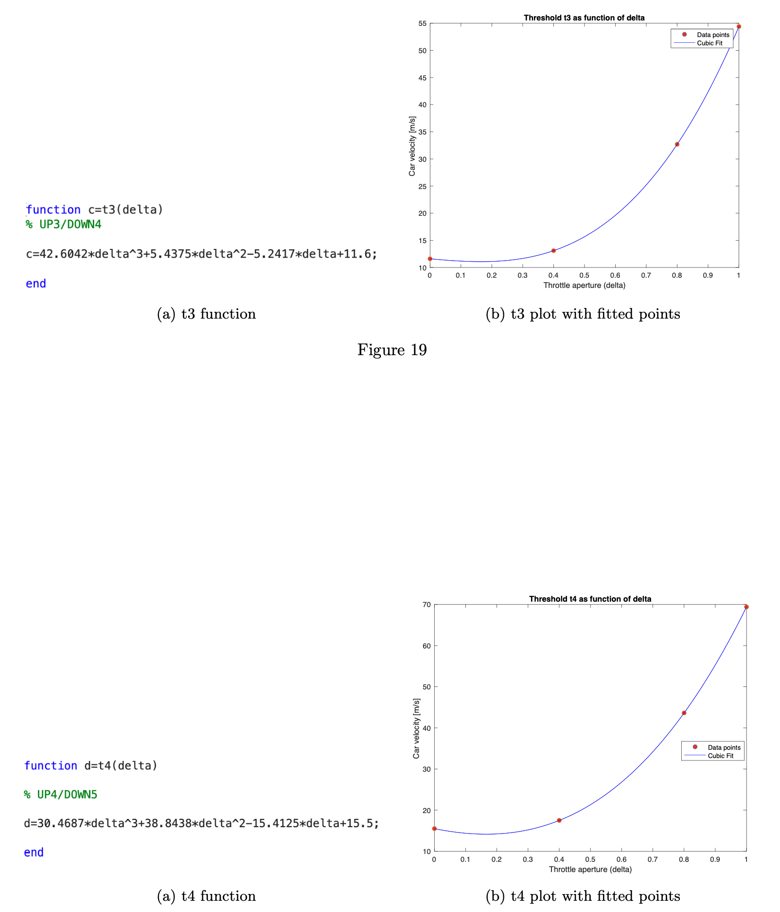
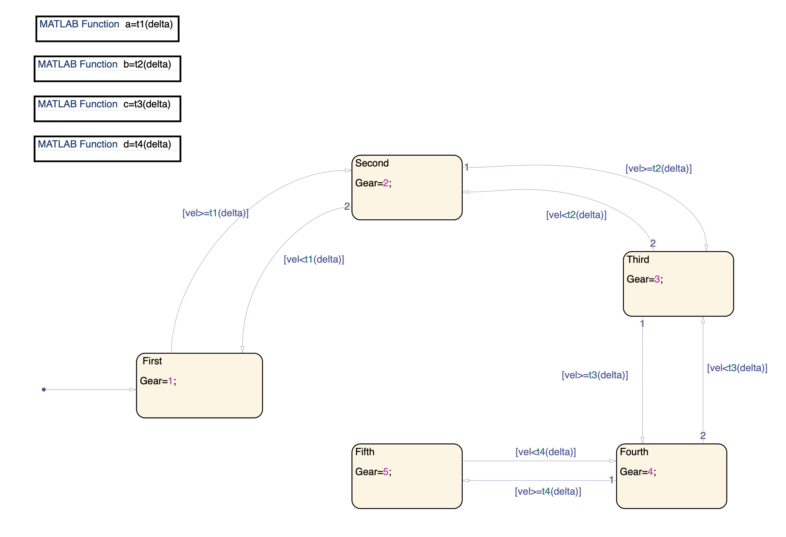
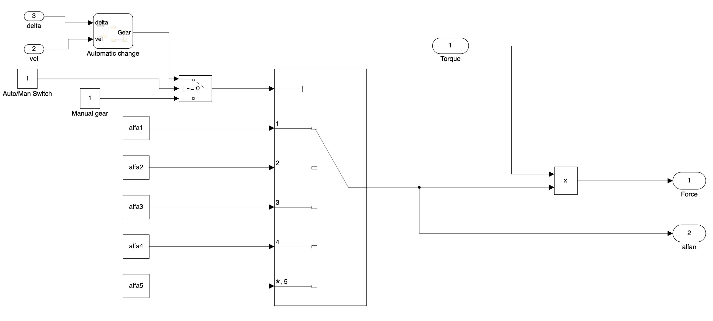

# Simulink Model of a Cruise Control System with Automatic Gear Shifting

This repository contains a MATLAB and Simulink project for the modeling, simulation, and analysis of an auto-trasmission cruise control system. The model implements a non-linear vehicle dynamics model, a Proportional-Integral (PI) controller for speed regulation, and a 5-speed automatic gear shifting logic using a StateFlow finite state machine.


## Features

- **Non-Linear Vehicle Dynamics:** The model simulates the car's motion by considering:
  - Tractive force from the engine based on throttle and engine speed.
  - Disturbance forces: aerodynamic drag, rolling friction, and gravitational load.
- **PI Cruise Controller:** A Proportional-plus-Integral (PI) controller maintains the vehicle's speed at a desired setpoint, complete with an anti-windup mechanism.
- ** Automatic Gear Shifting:** A 5-state StateFlow machine manages gear changes with a throttle-dependent logic, allowing for both aggressive (power-focused) and efficient (economy-focused) driving styles.
- **Interactive Simulation:** A `Driver Interface` block allows for real-time control of the desired speed, manual throttle, cruise control activation, and gear selection mode.

## Repo Structure

- `PBA1_LUIGI_VANACORE.pdf`: The detailed project report. 
- `control_loop.slx`: The main Simulink model file.
- `vehicles_param.m`: A MATLAB script that **must be run first**. It initializes all vehicle parameters and generates plots of the engine's power and torque curves.
- `fitting.m`: A MATLAB script that demonstrates how the gear shift threshold functions were derived using polynomial fitting.
- `images/`: A folder containing screenshots and plots for this README.

## The Automatic Gear Shift Logic

The automatic tramission logic is designed not just to shift gears, but to do so based on the driver's intent (communicated via the throttle).

### Maximizing Power Case

For maximum acceleration (e.g., during a 0-100 km/h run), the transmission should shift gears at points that keep the engine operating as close to its peak power output as possible. The plot below visualizes this strategy. The blue dots mark the optimal shift points for full throttle (`delta = 1`), and the resulting orange curve represents the maximum power envelope the vehicle can achieve.



### Adaptive Thresholds

A real transmission must adapt. Shifting at maximum power is inefficient for casual driving. To solve this, the shift thresholds are not fixed; they are **functions of the throttle aperture (`delta`)**. Using MATLAB's `polyfit` function, I created cubic polynomials that map throttle input to a corresponding shift speed. This allows the system to shift at high RPMs under full throttle and low RPMs under light throttle. The plots below show the fitted curves for the gear change thresholds.




### The StateFlow Machine

This adaptive logic is implemented in a StateFlow chart.
- Each **State** represents a gear (First, Second, etc.).
- The **Transitions** between gears are guarded by conditions like `[vel >= t1(delta)]`, where `t1` is the MATLAB function derived from the polynomial fit.



### The "Gears and Wheels" Subsystem

Finally, the StateFlow logic is integrated into the main Simulink model within the `Gears and Wheels` subsystem. This block takes the `Gear` number from the StateFlow chart and uses a Multi-Port Switch to select the correct transmission ratio (`alfa`). This ratio is then multiplied by the engine torque to calculate the final tractive force applied to the vehicle's body.



## How to Run the Simulation

1.  **Set Up the Environment:**
    - Make sure you have MATLAB, Simulink, and StateFlow installed.
    - Open MATLAB and navigate to the project directory.

2.  **Initialize Parameters:**
    - Run the `vehicles_param.m` script from the MATLAB command window.
      ```matlab
      >> vehicles_param
      ```
    - This will load all necessary variables into the MATLAB workspace.

3.  **(Optional) Understand the Logic:**
    - Run the `fitting.m` script to see how the polynomial functions for the gear shift logic were created.
      ```matlab
      >> fitting
      ```

4.  **Open the Simulink Model:**
    - Open the `control_loop.slx` file.
      ```matlab
      >> open control_loop.slx
      ```

5.  **Run a Scenario:**
    - Configure the simulation using the interactive controls in the `Driver Interface` block.
    - Click the **Run** button in the Simulink toolbar to start the simulation.

## Requirements

-   MATLAB
-   Simulink
-   StateFlow

